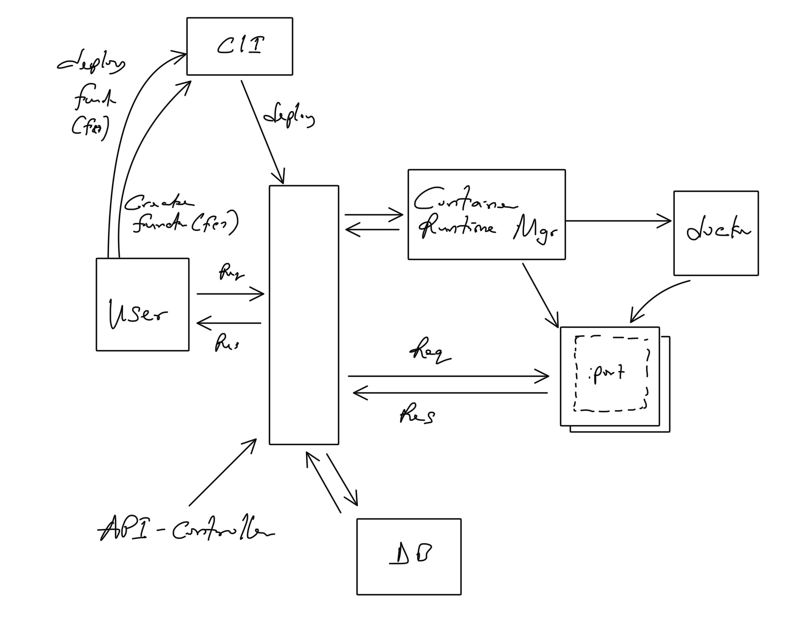

# serverless runtime (POC)

This is a simple serverless runtime that can be used to run serverless functions.

Supported languages:
- [x] Golang

TODO:
- [ ] Production readiness
- [ ] Add more languages
- [ ] Create docker wrapper
  - [x] Add docker wrapper
  - [ ] Remove thread spawn from runner
    - [ ] Have the runner process signer the caller when in ready state - no easy way on doing this
- [ ] Create API gateway
    - [x] Receive incoming request (function invocation)
      - [x] Signer start of function process
      - [x] Forward request to function process 
      - [x] Retrieve response from function process and bobble it backup
    - [ ] Function call
      - [ ] Forward URL param to function
      - [x] Forward function response header
      - [x] Forward request header to function
      - [x] Forward query param and body to function
      - [x] Add running function store
      - [x] Create a process that keeps the stare up to date
      - [x] Create a store that track running functions
      - [x] Dynamically create function port
      - [x] Start function If not started
      - [x] Check Is function already started
- [x] Create CLI
  - [x] Create function
  - [ ] Support environment variables
  - [x] Deploy function
  - [x] Make sure the function uses the same go version as the docker image 
  - [x] Support multiple files
  - [x] Support go module system
   