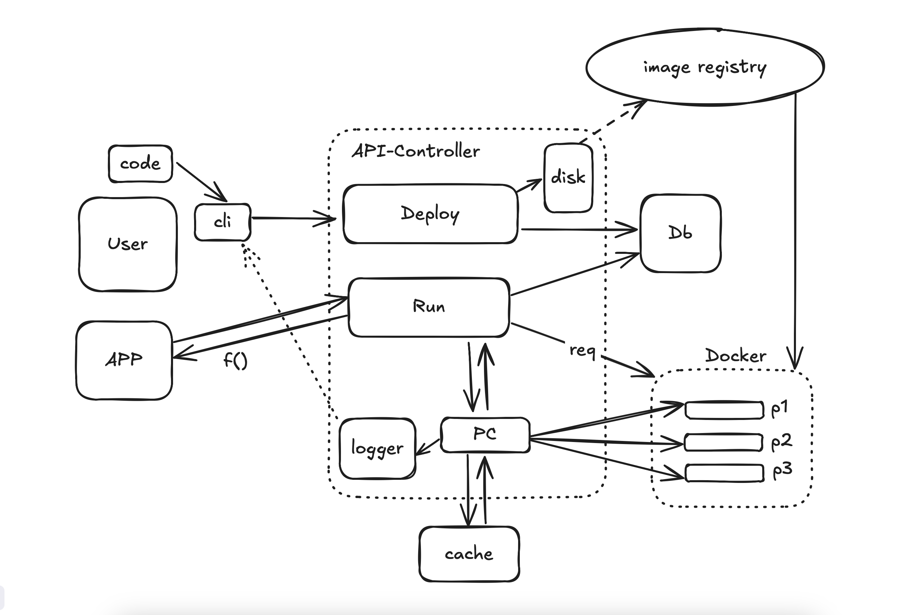

# Serverless Framework (POC)

A modern, lightweight, and self-hosted serverless framework that lets you deploy and run functions without managing servers. **This is a proof of concept and not production-ready.**

Try it now in your browser: [Invok Online Playground](https://freeserverless.com/invok/9447cdf0-d29a-4b0f-a6dc-4455b8291a6a/invok-ide)



## What is This Project?

This serverless framework is a proof of concept for building, deploying, and managing serverless functions in a performant and secure way. It demonstrates:

- **Serverless Core**: A core runtime that handles function invocation, deployment, and lifecycle management
- **Command-line Interface (CLI)**: A tool for creating, deploying, and managing serverless functions
- **Authentication System**: User management for controlled access to serverless resources
- **Function Namespacing**: Each user's functions are isolated in their own namespace

Unlike cloud provider offerings, this framework runs entirely on your infrastructure, giving you complete control over your environment and functions.

## Current Status

This project is currently in **proof of concept** stage. While it demonstrates the core concepts of a self-hosted serverless framework, it is not yet production-ready. Key limitations include:

- Limited runtime support (currently only Go)
- Basic error handling and recovery
- No production-grade monitoring or logging
- Limited scalability testing
- No production security audit

## Why Use This Framework?

- **Self-hosted**: Run everything on your own infrastructure with no vendor lock-in
- **Simple Developer Experience**: Easy-to-use CLI for function management
- **Secure by Design**: JWT-based authentication and secure function isolation
- **Lightweight**: Optimized for performance with minimal overhead
- **Function Hot-reloading**: Quick iteration on your function code
- **Docker-based Isolation**: Each function runs in its own container for security and dependency isolation
- **Multi-tenant Support**: Function namespacing ensures separation between users

## Quick Start

### Online Playground (No Installation Required)

The fastest way to get started is to use our web-based playground:
[Invok Online Playground](https://freeserverless.com/invok/9447cdf0-d29a-4b0f-a6dc-4455b8291a6a/invok-ide)

This allows you to create, deploy, and test serverless functions directly in your browser without any setup.

### Prerequisites

For local development and deployment:

- Docker and Docker Compose
- Rust toolchain (for building the CLI)

### Running the Serverless Core

```sh
# Clone the repository
git clone https://github.com/yourusername/serverless.git
cd serverless

# Start the Serverless Core and dependencies with Docker Compose
docker-compose up -d

# Or run directly with Cargo
cargo run -p serverless_core
```

### Installing the CLI

```sh
# Build the CLI
cd cli
cargo build --release

# Optional: Move the binary to your PATH
cp target/release/invok /usr/local/bin
```

### Creating and Deploying Your First Function

```sh
# Register a user account
invok register --email user@example.com --password your_password

# Login
invok login --email user@example.com --password your_password

# Create a new function (defaults to Go runtime)
invok create -n hello-world

# Deploy your function
invok deploy -n hello-world

# List your deployed functions
invok list
```

## Key Components

### Serverless Core

The Serverless Core is the heart of the serverless framework:

- **Function Management**: Deploys, starts, and manages function lifecycles
- **Request Routing**: Routes incoming requests to the appropriate function
- **Authentication**: Verifies user identity and permissions
- **Database**: Persists function metadata and user information
- **Redis Cache**: Tracks running function state and improves performance
- **Function Namespacing**: Ensures function isolation between users

### CLI Tool

The CLI offers a streamlined developer experience:

- **Function Creation**: Generate function templates and scaffolding
- **Deployment**: Package and upload functions to the Serverless Core
- **Authentication**: Secure user management with login/registration
- **Function Listing**: View all deployed functions in a clean table format

### Docker Wrapper

Functions run in isolated Docker containers with:

- **Security Isolation**: Each function runs in its own container
- **Dependency Management**: Functions include all their dependencies
- **Runtime Support**: Currently supports Go with more runtimes planned

## Project Structure (core Components)

```
serverless_framework/
├── serverless_core/      # Core runtime engine and business logic
├── cli/                  # Command-line interface tool
├── db_migrations/        # Database migrations
├── db_entities/          # Database entity definitions
├── shared_utils/         # Shared function utilities
├── assets/               # Project assets
```

## Authentication Flow

The framework uses JWT-based authentication:

1. Users register or login through the CLI
2. The Serverless Core validates credentials and issues a JWT token
3. The CLI stores the token locally for future requests
4. Functions are deployed and managed with authenticated requests

## Function Namespacing

The framework implements function namespacing to ensure isolation between different users:

1. Each function is associated with a user's UUID in the database
2. Functions are invoked using the URL pattern: `/invok/{user-uuid}/{function-name}`
3. A unique database index prevents name collisions within a user's namespace
4. The system validates that a user can only access and invoke their own functions
5. Container names include a hash of the user's UUID for better organization

This ensures that:

- Users can create functions with the same names without conflicts
- One user cannot access or modify another user's functions
- Function isolation is maintained both in the database and at runtime

## Contributing

We welcome contributions to enhance this proof of concept! Here are some areas where you can make an impact:

### Areas for Contribution

- **New Runtimes**: Currently we support Go, but Python, Node.js, and other runtimes would be valuable additions
- **Function Logs**: Implementing log collection and retrieval for deployed functions
- **Metrics and Monitoring**: Adding performance measurement capabilities
- **Testing Infrastructure**: Expanding test coverage for all components
- **Documentation**: Improving guides and examples
- **Production Readiness**: Help make this proof of concept production-ready

### Development Setup

1. Clone the repository
2. Install dependencies:
   - Rust toolchain
   - Docker and Docker Compose
   - PostgreSQL and Redis (or use Docker Compose)
3. Copy `.env.example` to `.env` and configure your environment
   ```sh
   make env
   ```
4. Run database migrations:
   ```sh
   cd db_migrations
   cargo run
   ```
5. Start the Serverless Core:
   ```sh
   cargo run -p serverless_core
   ```

### Technical Architecture Details

- **API**: Built with Axum web framework for high performance
- **Database**: Uses SeaORM with PostgreSQL
- **Cache**: Redis for function state tracking
- **Authentication**: JWT tokens with secure validation
- **Function Isolation**: Docker containers with network controls
- **Multi-tenancy**: Function namespacing with user UUIDs

## Roadmap to Production Readiness

- [ ] Support for additional runtimes (Python, Node.js, etc.)
- [ ] Function logs collection and viewing
- [ ] Role-based access control
- [ ] Function versioning
- [ ] Cold start optimization
- [ ] Web dashboard for function management
- [ ] Comprehensive error handling and recovery
- [ ] Production-grade monitoring and alerting
- [ ] Security audit and hardening
- [ ] Performance optimization and load testing
- [ ] CI/CD pipeline for automated testing
- [ ] More... (feel free to add to this list)

## License

This project is licensed under the [LICENSE](LICENSE) file in the repository.

## Demo

[Watch Quick Demo](https://youtu.be/qLKV_cO_XhQ?si=4lmvu8frlzH1yLNX)

A demo function running on a self-hosted enviroment here [invoke-demo-home-page](https://freeserverless.com/invok/9447cdf0-d29a-4b0f-a6dc-4455b8291a6a/home-page), function code [here](https://github.com/alob-mtc/invok-functions)

### Interactive Playground

Try out the serverless framework without installing anything using our web-based playground:
[Invok Playground](https://freeserverless.com/invok/9447cdf0-d29a-4b0f-a6dc-4455b8291a6a/invok-ide)

The playground allows you to:

- Create serverless functions directly in your browser
- Deploy functions instantly
- Test your functions with real-time execution
- Experiment with the framework's capabilities

Feel free to play around with the host here:
[serverless-framework-host](https://freeserverless.com)
deploy/host your own function and see it for yourself (try not to break the host-machine 😂 _it's a small size server for demo only_)
